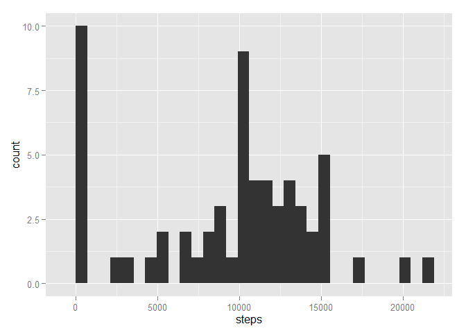

# Reproducible Research: Peer Assessment 1

## Loading and preprocessing the data


```r
con <- unz(description = "activity.zip", filename = "activity.csv")
activity <- read.csv(
  file = con,
  colClasses = c("integer", "Date", "integer"))
library(stringi)
library(chron)
```

```
## Warning: package 'chron' was built under R version 3.2.1
```

```r
int2time <- function(x)
  {h <- x %/% 100
   m <- x %%  100
   times(h %s+% ":" %s+% m %s+% ":0", format = "h:m:s")}
activity$interval <- int2time(activity$interval)
```


## What is mean total number of steps taken per day?

We can see here the distribution of the total number of steps made each day,
ignoring any missing values in the dataset.


```r
dailyActivity <- data.frame(
  date  = unique(activity$date),
  steps = tapply(activity$steps, activity$date, sum, na.rm=TRUE))

library(ggplot2)
qplot(steps, data = dailyActivity)
```

 

And here are the average and median of this distribution


```r
mean(dailyActivity$steps)
```

```
## [1] 9354.23
```

```r
median(dailyActivity$steps)
```

```
## [1] 10395
```

## What is the average daily activity pattern?

We now consider the average number of steps by interval across all days,
always ignoring missing values.
Here is the distribution obtained.


```r
intervalsActivity <- data.frame(
  interval = unique(activity$interval),
  steps    = tapply(activity$steps, activity$interval, mean, na.rm=TRUE))

g <- ggplot(intervalsActivity, aes(x = 24*interval, y = steps))
g <- g + geom_line()
g + scale_x_continuous(name = "hour", breaks = c(0, 6, 12, 18, 24))
```

 

We can observe which 5-minute interval, on average across all the days in the dataset, contains the maximum number of steps.


```r
intervalsActivity$interval[
 intervalsActivity$steps == max(intervalsActivity$steps)]
```

```
## [1] 08:35:00
```


## Imputing missing values

The total number of missing values is in fact very sensible :


```r
s <- sum(is.na(activity$steps))
s
```

```
## [1] 2304
```

Over a total of :


```r
l <- length(activity$date)
l
```

```
## [1] 17568
```

Which represent a proportion of :


```r
s/l
```

```
## [1] 0.1311475
```

Having missing values may underestimate the actual activity,
by replacing those with the average number of steps walked in each specific interval, as found in the preceding part, we hope to correct this effect.
We show here what we would have obtained in the first part (Average daily activity) with this procedure.


```r
filledActivity <- activity
filledActivity$mean <- intervalsActivity$steps
filledActivity$steps[is.na(filledActivity$steps)] <- filledActivity$mean[is.na(filledActivity$steps)]

dailyFilledActivity <- data.frame(
  date  = unique(filledActivity$date),
  steps = tapply(filledActivity$steps, filledActivity$date, sum, na.rm=TRUE))

qplot(steps, data = dailyFilledActivity)
```

 

```r
mean(dailyFilledActivity$steps)
```

```
## [1] 10766.19
```

```r
median(dailyFilledActivity$steps)
```

```
## [1] 10766.19
```


## Are there differences in activity patterns between weekdays and weekends?

We close this discussion with a plot showing the difference of activity patterns according to day type.


```r
dayType <- function(x){
  as.factor(ifelse(x %in% c("samedi", "dimanche"), "weekend", "weekday"))}
filledActivity$dayType <- dayType(weekdays(filledActivity$date))
filledActivityWeekday <- filledActivity[filledActivity$dayType=="weekday",]
filledActivityWeekend <- filledActivity[filledActivity$dayType=="weekend",]

intervalsFilledActivityByDayType <- data.frame(
  interval     = unique(filledActivity$interval),
  weekdaySteps = tapply(filledActivityWeekday$steps,
                        filledActivityWeekday$interval,
                        mean, na.rm=TRUE),
  weekendSteps = tapply(filledActivityWeekend$steps,
                        filledActivityWeekend$interval,
                        mean, na.rm=TRUE)               )
g1 <- ggplot(intervalsFilledActivityByDayType,
            aes(x = 24*interval, y = weekdaySteps))
g1 <- g1 + geom_line()
g1 <- g1 + scale_x_continuous(name = "", breaks = c(0, 6, 12, 18, 24))

g2 <- ggplot(intervalsFilledActivityByDayType,
            aes(x = 24*interval, y = weekendSteps))
g2 <- g2 + geom_line()
g2 <- g2 + scale_x_continuous(name = "hour", breaks = c(0, 6, 12, 18, 24))

multiplot <- function(...) {
  library(grid)
  plots <- list(...)
  numPlots = length(plots)
  layout <- matrix(seq(1, 1 * numPlots),
                   ncol = 1, nrow = numPlots)
grid.newpage()
pushViewport(viewport(layout = grid.layout(nrow(layout), ncol(layout))))
for (i in 1:numPlots) {
   matchidx <- as.data.frame(which(layout == i, arr.ind = TRUE))
   print(plots[[i]], vp = viewport(layout.pos.row = matchidx$row,
                                   layout.pos.col = matchidx$col ))}     }
multiplot(g1,g2)
```

 
